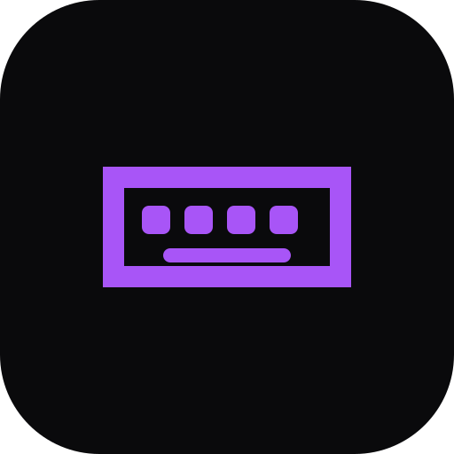

<div align="center">
  
  
  # ⌨️ TypeRush
  
  **Learn. Type. Improve. Rush.** 
  <br />
  A modern, highly engaging typing-speed learning game built with React, Vite, and Tailwind CSS.
  
  [](https://reactjs.org/)
  [](https://vitejs.dev/)
  [](https://tailwindcss.com/)
  [](https://www.typescriptlang.org/)
  [](#)

  [**Play the Live Demo**](https://ais-pre-wb7u3t37aroq72ctm7nibe-545718861873.asia-east1.run.app) • [**Report Bug**](../../issues) • [**Request Feature**](../../issues)
</div>

---

## 📸 Project Previews

> **Note to Developer:** *Replace these placeholder URLs with your actual screenshots once you push to GitHub! Save your screenshots in a `docs/` or `public/screenshots/` folder.*

<details>
  <summary><b>🔥 Click to view Application Screenshots</b></summary>
  <br/>

  <div align="center">
    <!-- Replace this URL with your actual dashboard screenshot -->
    
    <p><i>The sleek, dark-mode Dashboard tracking your WPM, Accuracy, and Daily Streak.</i></p>
  </div>
  
  <br/>

  <div align="center">
    <!-- Replace this URL with your actual game screenshot -->
    
    <p><i>Intense Arcade Minigames designed to train speed under pressure.</i></p>
  </div>
</details>

---

## 📖 About The Project

TypeRush is not just a standard typing test—it's an interactive arcade experience designed to help you improve your Words Per Minute (WPM) and accuracy through progressive lessons, daily challenges, and intense minigames. It uses a custom-built typing engine to track your performance in real-time.

### ✨ Key Features

*   **🎮 4 Unique Arcade Minigames:** Practice under pressure!
    *   🧟 **Zombie Defense:** Survive the horde by typing words to shoot.
    *   ☄️ **Asteroid Defender:** Dodge space debris by destroying targeted rocks.
    *   👨‍💻 **Matrix Drop:** Hack the mainframe and type falling code blocks.
    *   🏎️ **Neon Race:** Race against an AI car that scales with your difficulty setting.
*   **📚 50 Progressive Lessons:** Journey from basic home-row keystrokes all the way up to advanced React Hooks, Regex, Docker configs, and Hex Colors (The Grandmaster Apex).
*   **🏆 Daily Challenges & Streaks:** Form a habit with unique daily quotes and build your typing streak multiplier.
*   **📊 Advanced Analytics:** Track your WPM, accuracy, total characters typed, and unlock achievements as you level up.
*   **🔊 Immersive Audio Engine:** High-quality sound effects provide satisfying feedback for keystrokes, errors, and game events.
*   **📱 PWA Ready:** Install TypeRush directly to your desktop or mobile home screen as a standalone app!

---

## 🚀 Getting Started

Want to run TypeRush locally on your machine or contribute to the code? Follow these simple steps:

### Prerequisites
Make sure you have [Node.js](https://nodejs.org/) installed (v18 or higher recommended).

### Installation

1. **Clone the repository:**
   ```bash
   git clone https://github.com/your-username/typerush-app.git
   cd typerush-app
   ```

2. **Install dependencies:**
   ```bash
   npm install
   ```

3. **Start the development server:**
   ```bash
   npm run dev
   ```

4. Open your browser and navigate to `http://localhost:3000`.

---

## 📂 Project Architecture

A quick overview of the core file structure to help you navigate the codebase:

```text
📦 typerush-app
 ┣ 📂 public/              # Static public assets (icons, PWA manifests)
 ┣ 📂 src/
 ┃ ┣ 📂 components/        # Reusable UI parts
 ┃ ┃ ┣ 📜 Navigation.tsx     # Sidebar navigation menu
 ┃ ┃ ┣ 📜 VirtualKeyboard.tsx# On-screen keyboard visualizer
 ┃ ┃ ┗ 📜 StreakCalendar.tsx # Daily streak visualizer
 ┃ ┣ 📂 lib/               # Core game logic and utilities
 ┃ ┃ ┣ 📜 typingEngine.ts    # WPM and accuracy calculation logic
 ┃ ┃ ┗ 📜 audio.ts           # Sound effect synthesizers
 ┃ ┣ 📂 screens/           # Main application views
 ┃ ┃ ┣ 📜 Dashboard.tsx      # Main hub
 ┃ ┃ ┣ 📜 Lessons.tsx        # 50-level progression screen
 ┃ ┃ ┣ 📜 Games.tsx          # Arcade game selector
 ┃ ┃ ┣ 📜 ZombieGame.tsx     # Zombie survival typing minigame
 ┃ ┃ ┣ 📜 AsteroidGame.tsx   # Asteroid dodging minigame
 ┃ ┃ ┣ 📜 MatrixGame.tsx     # Hacker/Terminal typing mode
 ┃ ┃ ┗ 📜 RaceGame.tsx       # AI Racing minigame
 ┃ ┣ 📜 App.tsx            # Main application router/wrapper
 ┃ ┣ 📜 store.ts           # Global state management (Zustand)
 ┃ ┣ 📜 data.ts            # Static data (50 Lessons, Achievements)
 ┃ ┗ 📜 types.ts           # Global TypeScript interfaces
 ┣ 📜 index.html           # HTML entry point
 ┣ 📜 package.json         # Project dependencies and scripts
 ┗ 📜 vite.config.ts       # Vite bundler & PWA configuration
```

---

## 🌍 Deployment

TypeRush is fully optimized for static hosting platforms. We have included two detailed deployment guides in the repository:

*   **[Deploying to Vercel](./DEPLOYMENT_VERCEL.md)** (Recommended for ease of use)
*   **[Deploying to GitHub Pages](./DEPLOYMENT_GITHUB.md)** (Great for entirely free, static front-end hosting)

---

## 🛠️ Tech Stack Explained

*   **[React 18](https://react.dev/)** - Core UI Library using Functional Components & Hooks.
*   **[Vite](https://vitejs.dev/)** - Next-generation frontend tooling for instant server starts and lightning-fast HMR.
*   **[Tailwind CSS v4](https://tailwindcss.com/)** - Utility-first CSS framework for rapid, responsive dark-mode styling.
*   **[Framer Motion](https://motion.dev/)** - Powerful animation library used for route transitions and game object animations.
*   **[Lucide React](https://lucide.dev/)** - Beautiful, consistent icon set.
*   **[Zustand](https://zustand-demo.pmnd.rs/)** - A small, fast, and scalable bearbones state-management solution used to track global XP and user stats.
*   **Vite PWA Plugin** - Transforms the app into an installable Progressive Web App with offline support.

---

## 🤝 Contributing

Contributions, issues, and feature requests are welcome! Feel free to check the [issues page](../../issues) if you want to contribute.

1. Fork the Project
2. Create your Feature Branch (`git checkout -b feature/AmazingFeature`)
3. Commit your Changes (`git commit -m 'Add some AmazingFeature'`)
4. Push to the Branch (`git push origin feature/AmazingFeature`)
5. Open a Pull Request

---

## 📝 License

This project is open-source and available under the [MIT License](LICENSE).
